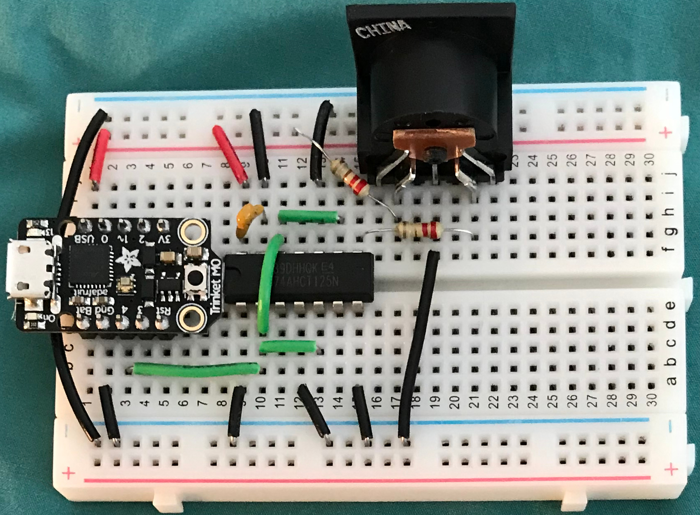

# MIDI DIN to MIDI USB Host Converter

The old way of making an Arduino MIDI USB host to MIDI DIN converter consists
of an Uno, a USB host shield, and a MIDI DIN shield.

This project uses an Adafruit Trinket M0 which has USB host capability. The USB
Host Library for SAMD and a USB OTG to USB host cable or adapter is required.

## Dependencies

* MIDI Library by Forty Seven Effects
* [USB Host Library for SAMD](https://github.com/gdsports/USB_Host_Library_SAMD)

## Components

* 1 x Trinket M0
* 2 x 220 Ohm resistors
* 1 x .1 uF ceramic capacitor
* 1 x 5 pin DIN connector
* 1 x TI SN74AHCT125, Logic level converter and driver
* 1 x USB OTG to host cable or adapter

## Related Project

[dsp-G1 synth]https://hackaday.io/project/161652-portable-midi-dsp-g1-synth

